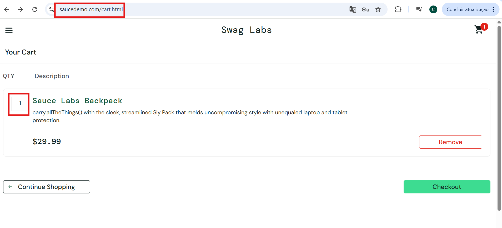
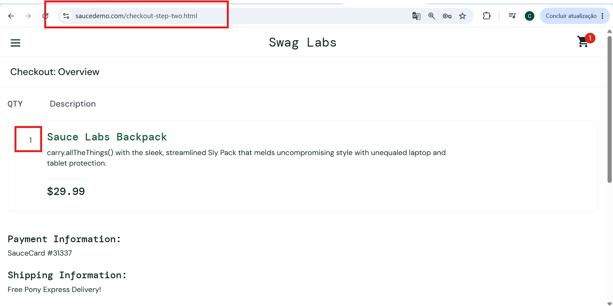

# MELHORIA-001 - Permitir edição da quantidade de produtos no carrinho e checkout

| Campo | Descrição |
|--------|-----------|
| ID | MELHORIA-001 |
| Módulo | Carrinho / Checkout |
| Severidade | Baixa |
| Prioridade | Média |
| Tipo | Usabilidade / Funcionalidade |
| Ambiente | https://www.saucedemo.com/ |
| Usuário | standard_user |

## Descrição

Atualmente, não é possível editar diretamente a quantidade de um produto nas telas de **Carrinho** e **Checkout**.

Para adicionar múltiplas unidades do mesmo produto, o usuário precisa retornar ao catálogo e clicar repetidamente no botão **Add to cart**, tornando o processo de compra mais lento e menos prático.

## Justificativa

A ausência de um controle de quantidade dificulta a alteração da quantidade de produtos durante o processo de compra.

A funcionalidade poderia proporcionar uma experiência de compra mais simples e eficiente, permitindo que o usuário ajuste a quantidade desejada sem precisar retornar ao catálogo.

## Impacto no usuário

O usuário precisa realizar ações adicionais para comprar mais de uma unidade do mesmo produto, aumentando a quantidade de etapas necessárias para concluir a compra.

Isso pode tornar o processo menos intuitivo e gerar uma experiência de compra menos eficiente.

## Passos para reprodução

1. Acessar https://www.saucedemo.com/.
2. Realizar login utilizando o usuário `standard_user`.
3. Adicionar um produto ao carrinho.
4. Acessar o carrinho.
5. Tentar alterar a quantidade do produto.
6. Avançar para a tela de checkout.
7. Tentar alterar novamente a quantidade do produto.

## Comportamento atual

Não existe uma opção para editar diretamente a quantidade do produto no **Carrinho** ou **Checkout**.

Para adicionar mais unidades do mesmo produto, é necessário retornar ao catálogo e clicar novamente no botão **Add to cart** para cada unidade desejada.

## Sugestão de melhoria

Disponibilizar um controle de quantidade diretamente no **Carrinho** e/ou **Checkout**, permitindo ao usuário aumentar ou diminuir a quantidade do produto.

Uma possível implementação seria utilizar:

- Campo numérico para informar a quantidade desejada;
- Botão `+` para aumentar a quantidade;
- Botão `-` para diminuir a quantidade.

Ao alterar a quantidade, o sistema deve atualizar automaticamente os valores relacionados à compra.

## Resultado esperado

O usuário deve conseguir alterar a quantidade de um produto diretamente no **Carrinho** e/ou **Checkout**, sem precisar retornar ao catálogo.

A alteração deve refletir automaticamente nos valores da compra, como subtotal e total, quando aplicável.

## Evidência

---