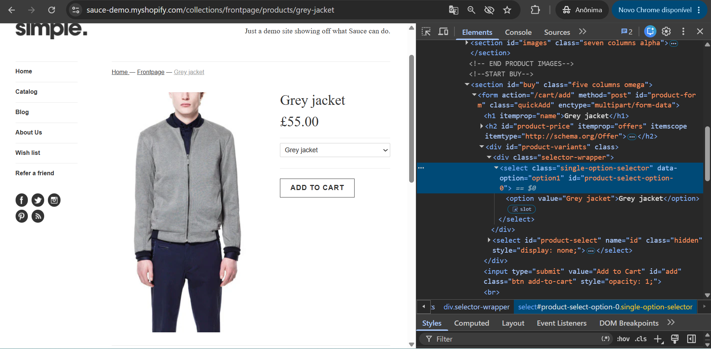
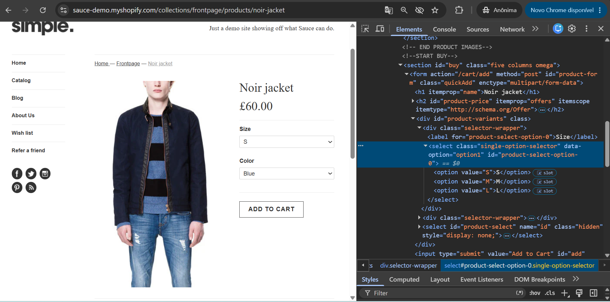
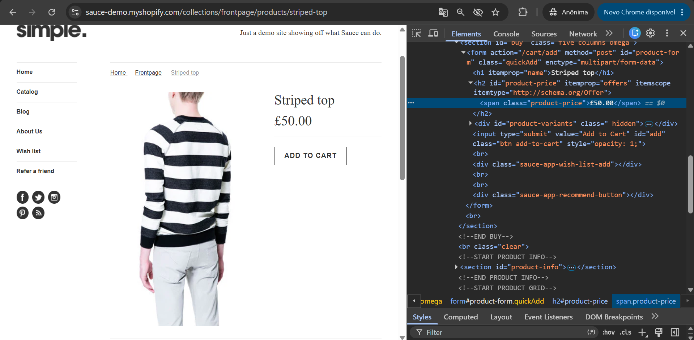

# BUG-001 - Inconsistencia nas opções de variação dos produtos do catálogo

## Informações Gerais

| Campo | Valor |
|--------|--------|
| ID | BUG-001 |
| Tipo | Funcional |
| Severidade | Alta |
| Prioridade | Alta |
| Status | Aberto |
| Ambiente | Produção |
| Navegador | Google Chrome 149 |
| Sistema | Windows 11 |

---

## Resumo

Os produtos do catálogo apresentam comportamentos inconsistentes quanto às opções de seleção de atributos. Alguns itens permitem selecionar apenas a cor, outros não disponibilizam seleção de tamanho e alguns podem ser adicionados diretamente ao carrinho sem qualquer escolha de variação. Caso exista uma padronização esperada para os produtos da loja, esse comportamento pode gerar dúvidas durante a experiência de compra.

---

## Pré-condições

- Produto disponível no catálogo.

---

## Passos para reproduzir

1. Acessar a plataforma
2. Acessar o catálogo.
3. Selecionar um produto.
4. Verificar as opções disponíveis do produto

---

## Resultado esperado

- Deve existir uma padronização para todos os itens com seleção de tamanhos. O usuário deve poder escolher o tamanho da peça desejada.

---

## Resultado obtido

- Itens da mesma categoria estão estão sem um padrão de exibição.

---

## Impacto

O usuário é obrigado a comprar um item sem saber o tamanho do mesmo. 

---

## Evidências

---

## Observações

Todos os itens devem exibir o tamanho, mesmo que seja "tamanho único".