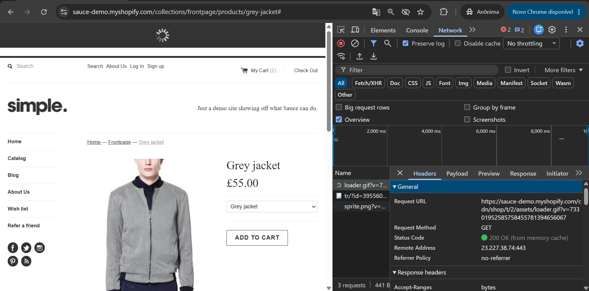
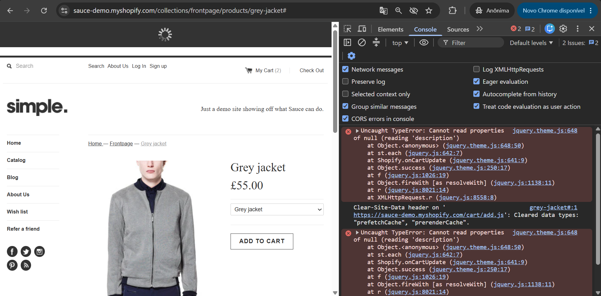

# BUG-002 - Não é possível visualizar o carrinho após adicionar um item

## Informações Gerais

| Campo | Valor |
|--------|--------|
| ID | BUG-002 |
| Tipo | Funcional |
| Severidade | Média |
| Prioridade | Média |
| Status | Aberto |
| Ambiente | Produção |
| Navegador | Google Chrome 149 |
| Sistema | Windows 11 |

---

## Resumo

Após adicionar um item ao carrinho, ao clicar no botão "My Cart", a página do carrinho não é carregada, impedindo o usuário de prosseguir com o processo de compra.

---

## Pré-condições

- Estar na pagina de detalhes do produto e não sair dela após adicinar o item ao carrinho.

---

## Passos para reproduzir

1. Acessar a plataforma
2. Acessar o catálogo.
3. Acessar produto.
4. Adicionar item ao carrinho.
5. Clicar em "My Cart".

---

## Resultado esperado

- Que o carrinho seja exibido em qualquer momento em que o usuário clique em "My Cart".

---

## Resultado obtido

- Tela com carregamento infinito e o carrinho não exibido. 
- O carrinho é exibido apenas se o usuário atualizar a tela.

---

## Impacto

Impede o usuário de seguir com a compra.

---

## Evidências

