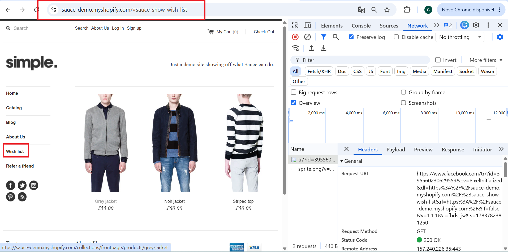

# BUG-003 - Opções "Wish List" e "Refer a Friend" do menu não executam nenhuma ação

## Informações Gerais

| Campo | Valor |
|--------|--------|
| ID | BUG-003 |
| Tipo | Funcional |
| Severidade | Baixa |
| Prioridade | Baixa |
| Status | Aberto |
| Ambiente | Produção |
| Navegador | Google Chrome 149 |
| Sistema | Windows 11 |

---

## Resumo

Ao clicar nas opções "Wish List" e "Refer a Friend" disponíveis no menu da aplicação, nenhuma ação é executada. O sistema não realiza redirecionamento, não exibe mensagens ao usuário e não apresenta qualquer feedback visual, dando a impressão de que as funcionalidades estão indisponíveis ou sem implementação.

---

## Pré-condições

- Acessar o site, o menu já estará disponível.

---

## Passos para reproduzir

1. Acessar a plataforma.
2. Clicar em "Wish list" ou "Refer a friend".
3. Nada irá acontecer.

---

## Resultado esperado

- Deveria carregar a página que está exibida no menu.

---

## Resultado obtido

- Sem nenhum ação do sistema.

---

## Impacto

A tela não abre.

---

## Evidências

