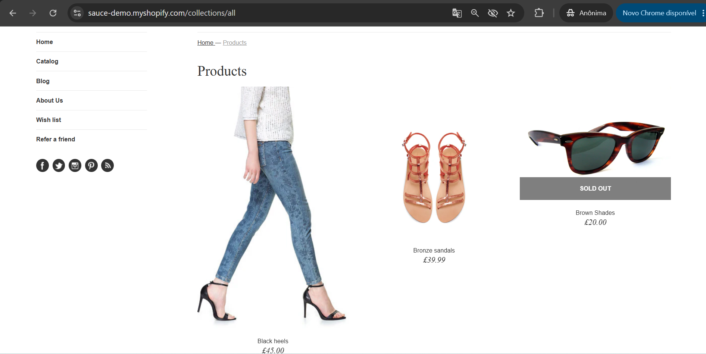

# MELHORIA-001 - Implementar categorias para organização do catálogo de produtos

## Informações Gerais

| Campo | Valor |
|--------|--------|
| ID | MELHORIA-001 |
| Tipo | Melhoria |
| Prioridade | Média |
| Status | Aberto |
| Ambiente | Produção |
| Navegador | Google Chrome 138 |
| Sistema | Windows 11 |
| Data | xx/xx/2026 |

---

## Resumo

Atualmente, o catálogo exibe todos os produtos em uma única listagem, independentemente do seu tipo. Essa organização dificulta a localização de itens específicos e pode impactar negativamente a experiência do usuário, principalmente em catálogos maiores.

---

## Situação Atual

- Todos os produtos são apresentados na mesma página.
- Não existem categorias ou filtros por tipo de produto.
- O usuário precisa percorrer toda a lista para localizar o item desejado.

---

## Proposta de Melhoria

Implementar categorias ou filtros para organizar os produtos por tipo, por exemplo:

- Camisetas
- Calçados
- Bonés
- Óculos
- Acessórios

Essa organização permitiria que o usuário encontrasse produtos com mais rapidez e facilidade.

---

## Benefício Esperado

- Melhor organização do catálogo.
- Navegação mais intuitiva.
- Facilidade para localizar produtos.
- Melhor experiência do usuário.
- Maior escalabilidade para futuros produtos.

---

## Evidências

### Catálogo atual

---

## Observações

Esta sugestão foi registrada com base na análise exploratória da aplicação e visa aprimorar a usabilidade do catálogo, não estando relacionada a um defeito funcional.