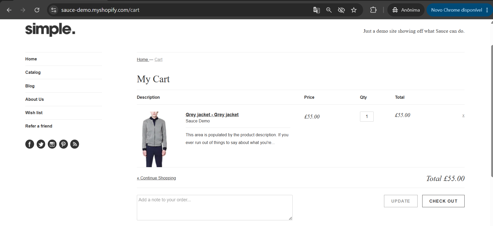
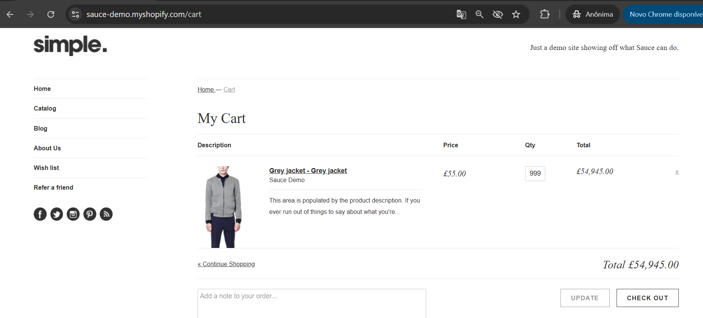

# MELHORIA-002 - Recalcular os valores do carrinho automaticamente ao alterar a quantidade

## Informações Gerais

| Campo | Valor |
|--------|--------|
| ID | MELHORIA-002 |
| Tipo | Melhoria |
| Prioridade | Média |
| Status | Aberto |
| Ambiente | Produção |
| Navegador | Google Chrome 138 |
| Sistema | Windows 11 |
| Data | xx/xx/2026 |

---

## Resumo

Atualmente, ao alterar a quantidade de um produto no carrinho, o sistema exige que o usuário clique no botão **"Update"** para que a alteração seja aplicada e os valores sejam recalculados. Esse comportamento pode passar despercebido, fazendo com que o usuário acredite que a quantidade foi atualizada quando, na realidade, o carrinho ainda mantém os valores anteriores.

---

## Situação Atual

- O usuário altera a quantidade de um produto no carrinho.
- A alteração não é aplicada automaticamente.
- O subtotal e o valor total permanecem inalterados até que o botão **"Update"** seja acionado.

---

## Proposta de Melhoria

Atualizar automaticamente o carrinho sempre que a quantidade de um produto for alterada, recalculando os valores sem a necessidade de uma ação adicional por parte do usuário.

Caso a atualização automática não seja tecnicamente viável, uma alternativa é destacar visualmente que existem alterações pendentes e que é necessário clicar no botão **"Update"** para aplicá-las.

---

## Benefício Esperado

- Processo de compra mais intuitivo.
- Redução da possibilidade de erros por parte do usuário.
- Atualização imediata dos valores do carrinho.
- Melhor experiência durante o fluxo de compra.
- Maior alinhamento com o comportamento adotado pela maioria dos e-commerces atuais.

---

## Evidências

### Carrinho de compras

Após clicar no botão "UPDATE" a tela foi atualizada:

---

## Observações

Esta sugestão foi registrada com base na análise exploratória da aplicação e tem como objetivo aprimorar a experiência do usuário durante o gerenciamento do carrinho de compras, não estando relacionada a um defeito funcional.